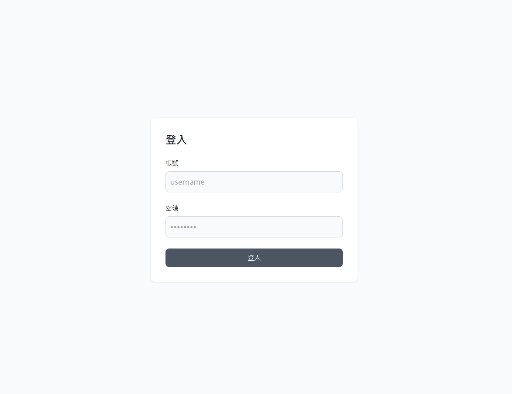
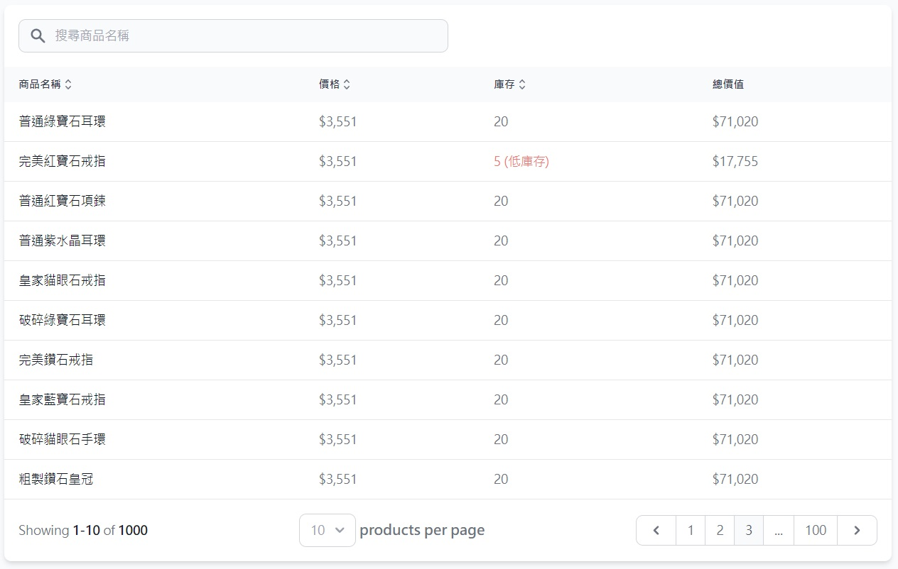

# Interview fe-simple-datatable

## Setup

### Requirement

* pnpm 9.14.2
* nodejs v20.11.0

### Setup step

```sh
pnpm install
cp web/.env.example web/.env
pnpm --filter web dev
```

### Deployment

```sh
docker build -t symphox-tlf-fe-interview-web:latest -f web/Dockerfile .
```

## 如何啟動 mock server

* 確認你的環境能夠使用 docker / make 指令
* 執行 `make run-mock`
* 用 browser 打開 `http://localhost:8000/docs` 確認 mock api server 是否正確啟動

## 任務需求

請完成一個 web application、使用的 js/css techstack 不限、但必須滿足以下條件

* 必須是 SPA(single page application) 形式
* CSR(client side rendering) only，最後成品必須要能夠以 static file 的方式 deploy
* 包含以下 route
  * /login - 登入頁面
  * /logout - 登出頁面
  * /products - 商品列表頁面，這頁需要登入


## 頁面細節

### /login

* 一個簡單的 login form，上下左右置中對齊
* 登入成功後，自動轉導至 /products



### /logout

* 無 wireframe
* 置中顯示
```
已登出
將於 10 秒後自動回到登入頁面
```
* 10 秒後會自動將使用者轉導回 /login


### /products

* 呼叫 product api 並將對應的資料顯示在 data table 上
* data table 需要實作以下功能並以對應的參數呼叫 product api:
  * 搜尋商品名稱
  * 針對不同的欄位進行排序
  * 分頁功能
    * 能顯示現在頁面以及總頁面數量
    * 能夠切換單一頁面顯示商品數量 (10/20/40)
  * 低庫存警告(庫存 <= 10 的時候顯示)
  * 總價值顯示(庫存 * 價格)


